# Thomas Moisés Fernandes

### Desenvolvedor Frontend

  

 

[🇺🇸 | EN-US](https://github.com/thomasmfx/thomasmfx/blob/main/README.md)

## 📜 Sobre mim

- 📍 São Paulo, Brasil
- 👨‍💻 Desenvolvedor Frontend. Apaixonado por criar websites dinâmicos, intuitivos e de alto desempenho.
- 👨‍🎓 Estudante de Análise e Desenvolvimento de Sistemas na [FATEC-MC](https://www.fatecmogidascruzes.com.br/)
- 🔠 Inglês - [C1 Avançado](https://cert.efset.org/jd3519)
- 🌱 Atualmente aprofundando meus conhecimentos em React e ferramentas modernas de desenvolvimento web.

 

## 🚀 Projetos

 
  
  
  

 

## 📚 Habilidades

 

  

 

## ☕ Contato

📝 *Life is a journey, not a destination.*

